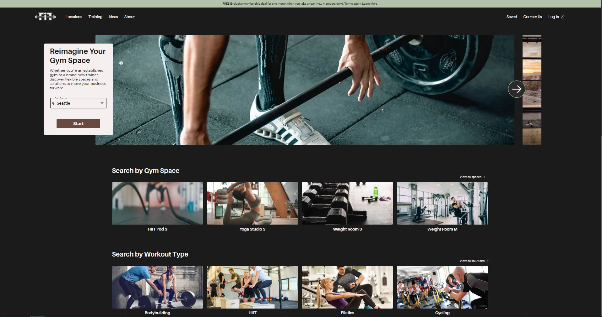

## Functional Intense Training (FIT)

Functional Intense Training (FIT) is a market place platform website, for connecting gym owners with personal trainers, and class attendees. The business model is similar to that of WeWork, but for gyms.

### Built with:

NextJS Styled Components MongoDB

### Package Manager

NPM is used for this project. This project was built with Webpack for, so to make sure you do not run into any errors run the following command first `npm run build`, and then `npm run start` to make sure that it runs correctly.

## Live

<a href='https://functionalintense.training/' target='_blank'>Functional Intense Training (FIT)</a>

## Project Screen Shot

